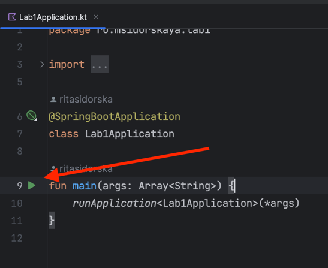

# Page visit counter

(and current moscow time)

The application has 3 features:

- shows how many times the page was opened by `GET /` request from the last application start
- shows how many times the page was opened by `GET /visits` request regardless of restarts
- shows current Moscow time by `GET /time` request

### `/visits` page
The application uses separate file to save its state after shutting down. 
To test it I opened the `/visits` page several times and checked that the number grows:


Then I shutted down the application, restarted it and opened the page again:


I see that application didn't start its count from 0 but continued from the last value.

## How to run

### Prerequisite:

Maven installed ([official installation guide](https://maven.apache.org/install.html))

`brew install mvn` for macOS

### Running from command line

```
cd app_kotlin/lab1
mvn spring-boot:run
```

### Running from Intellij IDEA

1. Open the `app_kotlin` path as new Project.
2. Run the application by `Run` button near `main` method of `Lab1Application.kt` file: 

3. Server runs on default localhost path http://127.0.0.1:8080/ which can be opened in any browser. The page shows how
   many times this page was opened from the server start. The second page http://127.0.0.1:8080/time displays current
   time in Moscow timezone.

## Docker

You can pull the latest version and **run** it by the following command:

```
docker run -it -p 8080:8080 klemencja/app_kotlin
```

The application will be deployed on your http://127.0.0.1:8080/

To **build** the updated version you may change the directory to `core-course-labs` and run `docker build`

```
cd core-course-labs
docker build app_kotlin -t app_kotlin
```

To just **pull** an image from dockerhub you can use:

```
docker pull klemencja/app_kotlin
``` 

## Unit tests

The project contains unit tests for controllers. You can run them using the following maven command:

```
cd app_kotlin/lab1
mvn test
``` 

It will find all the tests and run them.

## CI workflow

My CI workflow for the kotlin app contains 2 main jobs with substeps:

1. Build and test app:
    - Performs checkout
    - Prepares environment with Java and Maven
    - Builds an application to check it's not broken
    - Runs unit tests via `mv test`
    - Runs linter checks via `ktlint`
    - Performs SNYK code scanning and uploads its `.SARIF` report to github security
2. Push to dockerhub:
    - Performs checkout
    - Login to dockerhub on my personal account
    - Builds an application via Dockerfile
    - Uploads an application to [my dockerhub repository](https://hub.docker.com/repository/docker/klemencja/app_kotlin)
      with `klemencja/app_kotlin` tag

The second job needs complete passing of the first one to ensure invalid image won't be uploaded to dockerhub.