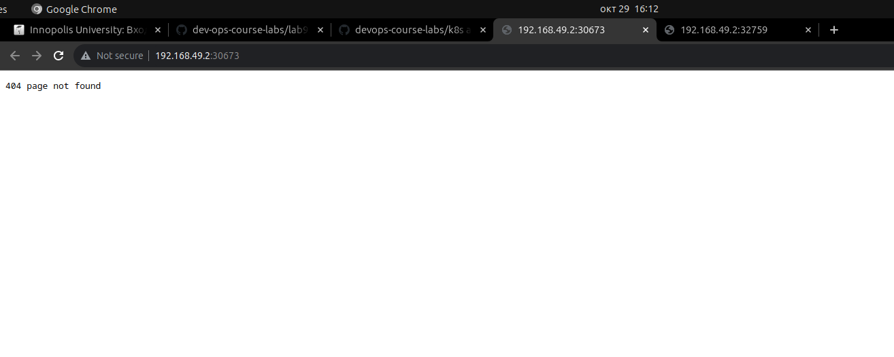
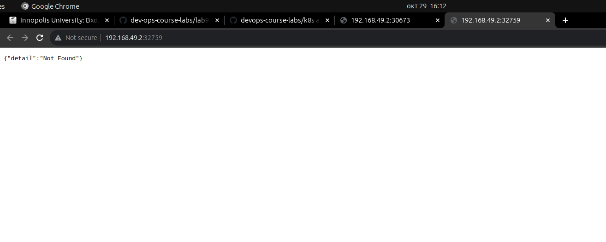

# Kubernetes

## Kubernetes Basic Deployment

* Create deployments
```shell
kubectl create deployment app-python --image=quiner/app-python:latest
kubectl create deployment app-go --image=quiner/app-go:latest
```

* Get deployments
```shell
quiner@quiner-MaiBook-X-series:~/innopolis/dev-ops-course-labs/k8s$ kubectl get deployments
NAME         READY   UP-TO-DATE   AVAILABLE   AGE
app-go       1/1     1            1           30s
app-python   1/1     1            1           49s
```

* Expose pods

```shell
kubectl expose deployment app-python --type=LoadBalancer --port=8080
kubectl expose deployment app-go --type=LoadBalancer --port=8070
```

* Get pods, services

```shell
quiner@quiner-MaiBook-X-series:~/innopolis/dev-ops-course-labs/k8s$ kubectl get pods,svc
NAME                              READY   STATUS    RESTARTS   AGE
pod/app-go-854cb798f7-n6msv       1/1     Running   0          3m23s
pod/app-python-7fc4bcbb9c-pclct   1/1     Running   0          3m42s

NAME                 TYPE           CLUSTER-IP       EXTERNAL-IP   PORT(S)          AGE
service/app-go       LoadBalancer   10.98.152.204    <pending>     8070:30841/TCP   71s
service/app-python   LoadBalancer   10.107.231.188   <pending>     8080:31576/TCP   81s
service/kubernetes   ClusterIP      10.96.0.1        <none>        443/TCP          51m
```

## Kubernetes Declarative Deployment

* Apply manifests

```shell
quiner@quiner-MaiBook-X-series:~/innopolis/dev-ops-course-labs/k8s$ kubectl apply -f app_python/deployment.yaml 
deployment.apps/python-deployment created
quiner@quiner-MaiBook-X-series:~/innopolis/dev-ops-course-labs/k8s$ kubectl apply -f app_python/service.yaml 
service/python-service created
quiner@quiner-MaiBook-X-series:~/innopolis/dev-ops-course-labs/k8s$ kubectl apply -f app_go/deployment.yaml 
deployment.apps/go-deployment created
quiner@quiner-MaiBook-X-series:~/innopolis/dev-ops-course-labs/k8s$ kubectl apply -f app_go/service.yaml 
service/go-service created
```

* Get pods, services

```shell
quiner@quiner-MaiBook-X-series:~/innopolis/dev-ops-course-labs/k8s$ kubectl get pods,svc
NAME                                     READY   STATUS    RESTARTS   AGE
pod/go-deployment-6b7f6d59fc-nlp8r       1/1     Running   0          30s
pod/go-deployment-6b7f6d59fc-pxz9l       1/1     Running   0          24s
pod/go-deployment-6b7f6d59fc-t68mf       1/1     Running   0          27s
pod/python-deployment-569769f57d-2mw4w   1/1     Running   0          4m52s
pod/python-deployment-569769f57d-9jtjr   1/1     Running   0          4m52s
pod/python-deployment-569769f57d-wphns   1/1     Running   0          4m52s

NAME                     TYPE           CLUSTER-IP     EXTERNAL-IP   PORT(S)          AGE
service/go-service       LoadBalancer   10.98.45.25    <pending>     8070:30673/TCP   4m37s
service/kubernetes       ClusterIP      10.96.0.1      <none>        443/TCP          63m
service/python-service   LoadBalancer   10.109.60.33   <pending>     8080:32759/TCP   4m47s
```

* Check service availability

```shell
quiner@quiner-MaiBook-X-series:~/innopolis/dev-ops-course-labs/k8s$ minikube service --all
|-----------|------------|-------------|---------------------------|
| NAMESPACE |    NAME    | TARGET PORT |            URL            |
|-----------|------------|-------------|---------------------------|
| default   | go-service |        8070 | http://192.168.49.2:30673 |
|-----------|------------|-------------|---------------------------|
|-----------|------------|-------------|--------------|
| NAMESPACE |    NAME    | TARGET PORT |     URL      |
|-----------|------------|-------------|--------------|
| default   | kubernetes |             | No node port |
|-----------|------------|-------------|--------------|
😿  service default/kubernetes has no node port
|-----------|----------------|-------------|---------------------------|
| NAMESPACE |      NAME      | TARGET PORT |            URL            |
|-----------|----------------|-------------|---------------------------|
| default   | python-service |        8080 | http://192.168.49.2:32759 |
|-----------|----------------|-------------|---------------------------|
🎉  Opening service default/go-service in default browser...
🎉  Opening service default/python-service in default browser...
```




## Ingress

* Enable ingress

```shell
minikube addons enable ingress
```

* Apply ingress
```shell
quiner@quiner-MaiBook-X-series:~/innopolis/dev-ops-course-labs/k8s$ kubectl apply -f app_python/ingress.yaml
ingress.networking.k8s.io/python-ingress created
quiner@quiner-MaiBook-X-series:~/innopolis/dev-ops-course-labs/k8s$ kubectl apply -f app_go/ingress.yaml
ingress.networking.k8s.io/go-ingress created
```

* Get ingress

```shell
quiner@quiner-MaiBook-X-series:~/innopolis/dev-ops-course-labs/k8s$ kubectl get ingress
NAME             CLASS            HOSTS        ADDRESS   PORTS   AGE
go-ingress       go-ingress       go.app                 80      35m
python-ingress   python-ingress   python.app             80      35m
```

* Check availability  

```shell
quiner@quiner-MaiBook-X-series:~/innopolis/dev-ops-course-labs/k8s$ curl python.app/healthcheck --resolve python.app:80:$(minikube ip)
{"message":"OK"}
```

```shell
quiner@quiner-MaiBook-X-series:~/innopolis/dev-ops-course-labs/k8s$ curl go.app/healthcheck --resolve go.app:80:$(minikube ip)
{"message":"OK"}
```