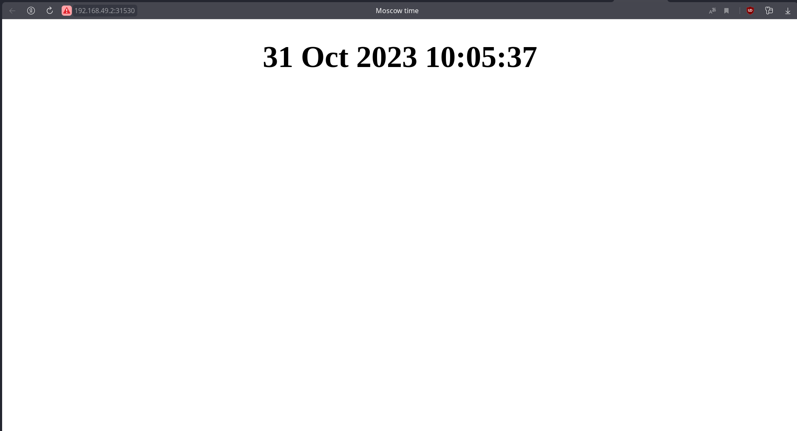

## Output example

1. After creating resources by hand, using commands

`> kubectl create deployment python-app --image=evalekalek/devops:latest`

`>  kubectl expose deployment python-app --type=LoadBalancer --port=8080`

`> kubectl get pods,svc`
```
NAME                             READY   STATUS    RESTARTS   AGE
pod/python-app-7bfbdfc54-r82wj   1/1     Running   0          4m17s

NAME                 TYPE           CLUSTER-IP      EXTERNAL-IP   PORT(S)          AGE
service/kubernetes   ClusterIP      10.96.0.1       <none>        443/TCP          4m31s
service/python-app   LoadBalancer   10.104.66.203   <pending>     8080:30953/TCP   2m49s
```

2. After creating resources from files `deployment.yml` and `service.yml`
`> kubectl apply -f service.yml -f deployment.yml`

`> kubectl get pods,svc`
```
NAME                                         READY   STATUS    RESTARTS   AGE
pod/python-app-deployment-7b5dcc947b-kvpgb   1/1     Running   0          15s
pod/python-app-deployment-7b5dcc947b-qxpfx   1/1     Running   0          15s
pod/python-app-deployment-7b5dcc947b-r9zcf   1/1     Running   0          15s

NAME                         TYPE           CLUSTER-IP       EXTERNAL-IP   PORT(S)        AGE
service/kubernetes           ClusterIP      10.96.0.1        <none>        443/TCP        13m
service/python-app-service   LoadBalancer   10.110.202.238   <pending>     80:31832/TCP   16s
```

3. After setting up everything
`> minikube service --all`
```
|-----------|------------|-------------|--------------|
| NAMESPACE |    NAME    | TARGET PORT |     URL      |
|-----------|------------|-------------|--------------|
| default   | kubernetes |             | No node port |
|-----------|------------|-------------|--------------|
😿  service default/kubernetes has no node port
|-----------|--------------------|-------------|---------------------------|
| NAMESPACE |        NAME        | TARGET PORT |            URL            |
|-----------|--------------------|-------------|---------------------------|
| default   | python-app-service |          80 | http://192.168.49.2:31530 |
|-----------|--------------------|-------------|---------------------------|
🎉  Opening service default/python-app-service in default browser...
Found ffmpeg: /opt/yandex/browser/libffmpeg.so                                                                                                                                                                                      
        avcodec: 3877988
        avformat: 3874916
        avutil: 3744870
Ffmpeg version is OK! Let's use it.
```

The working Python Web Application 
