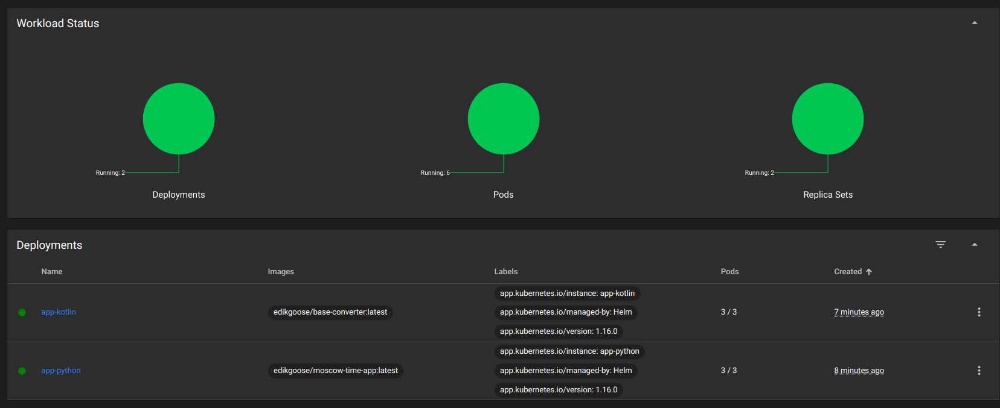

# Lab 10. Helm
## Task 1


```
~/iu-devops/k8s/helm/app-python$ minikube service app-python
|-----------|------------|-------------|---------------------------|
| NAMESPACE |    NAME    | TARGET PORT |            URL            |
|-----------|------------|-------------|---------------------------|
| default   | app-python | http/80     | http://192.168.49.2:30713 |
|-----------|------------|-------------|---------------------------|
🎉  Opening service default/app-python in default browser...
```


```
~/iu-devops/k8s/helm$ kubectl get pods
NAME                        READY   STATUS    RESTARTS   AGE
app-python-56ccd46d-5vqt6   1/1     Running   0          4m51s
app-python-56ccd46d-8ltdv   1/1     Running   0          5m44s
app-python-56ccd46d-mpx6g   1/1     Running   0          4m51s
```


```
~/iu-devops/k8s/helm$ kubectl get svc
NAME         TYPE        CLUSTER-IP       EXTERNAL-IP   PORT(S)        AGE
app-python   NodePort    10.103.153.133   <none>        80:30713/TCP   6m4s
kubernetes   ClusterIP   10.96.0.1        <none>        443/TCP        7d23h
```

## Task 2
```
~/iu-devops/k8s/helm$ kubectl get po
NAME                        READY   STATUS      RESTARTS   AGE
app-python-56ccd46d-95qm2   1/1     Running     0          91s
app-python-56ccd46d-mdptr   1/1     Running     0          91s
app-python-56ccd46d-pfsx2   1/1     Running     0          91s
postinstall-hook            0/1     Completed   0          91s
preinstall-hook             0/1     Completed   0          114s
```

```
~/iu-devops/k8s/helm$ kubectl describe po preinstall-hook
Name:             preinstall-hook
Namespace:        default
Priority:         0
Service Account:  default
Node:             minikube/192.168.49.2
Start Time:       Tue, 07 Nov 2023 19:06:21 +0300
Labels:           <none>
Annotations:      helm.sh/hook: pre-install
Status:           Succeeded
IP:               10.244.0.81
IPs:
  IP:  10.244.0.81
Containers:
  pre-install-container:
    Container ID:  docker://890221d24c7f8c4e1b0211a43a2a7e6a2fa4823a016e3f2cb071a406e79cea5d
    Image:         busybox
    Image ID:      docker-pullable://busybox@sha256:3fbc632167424a6d997e74f52b878d7cc478225cffac6bc977eedfe51c7f4e79
    Port:          <none>
    Host Port:     <none>
    Command:
      sh
      -c
      echo The pre-install hook is running && sleep 20
    State:          Terminated
      Reason:       Completed
      Exit Code:    0
      Started:      Tue, 07 Nov 2023 19:06:22 +0300
      Finished:     Tue, 07 Nov 2023 19:06:42 +0300
    Ready:          False
    Restart Count:  0
    Environment:    <none>
    Mounts:
      /var/run/secrets/kubernetes.io/serviceaccount from kube-api-access-bm4qh (ro)
Conditions:
  Type              Status
  Initialized       True 
  Ready             False 
  ContainersReady   False 
  PodScheduled      True 
Volumes:
  kube-api-access-bm4qh:
    Type:                    Projected (a volume that contains injected data from multiple sources)
    TokenExpirationSeconds:  3607
    ConfigMapName:           kube-root-ca.crt
    ConfigMapOptional:       <nil>
    DownwardAPI:             true
QoS Class:                   BestEffort
Node-Selectors:              <none>
Tolerations:                 node.kubernetes.io/not-ready:NoExecute op=Exists for 300s
                             node.kubernetes.io/unreachable:NoExecute op=Exists for 300s
Events:
  Type    Reason     Age    From               Message
  ----    ------     ----   ----               -------
  Normal  Scheduled  2m25s  default-scheduler  Successfully assigned default/preinstall-hook to minikube
  Normal  Pulled     2m25s  kubelet            Container image "busybox" already present on machine
  Normal  Created    2m25s  kubelet            Created container pre-install-container
  Normal  Started    2m25s  kubelet            Started container pre-install-container
```

```
~/iu-devops/k8s/helm$ kubectl describe po postinstall-hook
Name:             postinstall-hook
Namespace:        default
Priority:         0
Service Account:  default
Node:             minikube/192.168.49.2
Start Time:       Tue, 07 Nov 2023 19:06:44 +0300
Labels:           <none>
Annotations:      helm.sh/hook: post-install
Status:           Succeeded
IP:               10.244.0.83
IPs:
  IP:  10.244.0.83
Containers:
  post-install-container:
    Container ID:  docker://22b088a23fd8b20e20c6fe612ea13f635876dc9e4bcf6c5fd9270aa0365f3f82
    Image:         busybox
    Image ID:      docker-pullable://busybox@sha256:3fbc632167424a6d997e74f52b878d7cc478225cffac6bc977eedfe51c7f4e79
    Port:          <none>
    Host Port:     <none>
    Command:
      sh
      -c
      echo The post-install hook is running && sleep 15
    State:          Terminated
      Reason:       Completed
      Exit Code:    0
      Started:      Tue, 07 Nov 2023 19:06:49 +0300
      Finished:     Tue, 07 Nov 2023 19:07:04 +0300
    Ready:          False
    Restart Count:  0
    Environment:    <none>
    Mounts:
      /var/run/secrets/kubernetes.io/serviceaccount from kube-api-access-mrgcm (ro)
Conditions:
  Type              Status
  Initialized       True 
  Ready             False 
  ContainersReady   False 
  PodScheduled      True 
Volumes:
  kube-api-access-mrgcm:
    Type:                    Projected (a volume that contains injected data from multiple sources)
    TokenExpirationSeconds:  3607
    ConfigMapName:           kube-root-ca.crt
    ConfigMapOptional:       <nil>
    DownwardAPI:             true
QoS Class:                   BestEffort
Node-Selectors:              <none>
Tolerations:                 node.kubernetes.io/not-ready:NoExecute op=Exists for 300s
                             node.kubernetes.io/unreachable:NoExecute op=Exists for 300s
Events:
  Type    Reason     Age    From               Message
  ----    ------     ----   ----               -------
  Normal  Scheduled  2m34s  default-scheduler  Successfully assigned default/postinstall-hook to minikube
  Normal  Pulling    2m33s  kubelet            Pulling image "busybox"
  Normal  Pulled     2m30s  kubelet            Successfully pulled image "busybox" in 2.731284822s (2.731293742s including waiting)
  Normal  Created    2m30s  kubelet            Created container post-install-container
  Normal  Started    2m30s  kubelet            Started container post-install-container
```

## Bonus task
I used library chart named by "library-chart.labels".
It substitute all labels blocks


```
~/iu-devops/k8s/helm$ kubectl get pods
NAME                          READY   STATUS    RESTARTS        AGE
app-kotlin-5fc4dbd899-8vqk9   1/1     Running   1 (8m1s ago)    10m
app-kotlin-5fc4dbd899-r8r6v   1/1     Running   1 (8m1s ago)    10m
app-kotlin-5fc4dbd899-zpz87   1/1     Running   2 (5m54s ago)   10m
app-python-56df6c55f5-4txpl   1/1     Running   0               10m
app-python-56df6c55f5-xsp44   1/1     Running   0               10m
app-python-56df6c55f5-zw4pg   1/1     Running   0               10m
```

```
~/iu-devops/k8s/helm$ kubectl get svc
NAME         TYPE        CLUSTER-IP       EXTERNAL-IP   PORT(S)          AGE
app-kotlin   NodePort    10.104.110.151   <none>        8080:32658/TCP   10m
app-python   NodePort    10.106.139.201   <none>        80:30428/TCP     10m
kubernetes   ClusterIP   10.96.0.1        <none>        443/TCP          8d
```

Useful resources:
- https://opensource.com/article/20/5/helm-charts
- https://helm.sh/docs/chart_template_guide/getting_started/