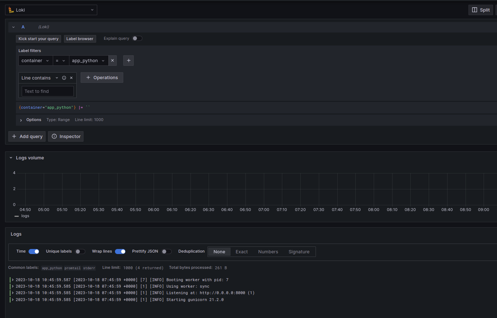

# Task 1

1. Studied the setup.

2. Created a monitoring folder, configs for grafana and promtail inside.

3. Created docker-compose.yml file that integrates Loki logging with simple python app from lab2.
   Additionally following these tutorials:

   * https://medium.com/@gpiechnik/loki-effective-logging-and-log-aggregation-with-grafana-c3356e7f13ad
   * https://stackoverflow.com/questions/71516943/promtail-service-discovery-based-on-label-with-docker-compose-and-label-in-gra

4. Added Loki as data source to Grafana, and tested.

# Task 2

1. **Promtail** - Combines and pushes app logs to loki, it's a 'client' of this setup. Multiple Promtail instances can forward logs to the same Loki instance from different apps.\
   **Loki** - Loki is a log aggregation system, it stores and processes logs. It's a 'backend' of this logging setup. Loki is efficient and cheap to operate, it indexes labels of log streams instead of logs themselves.\
   **Grafana** - Grafana is a visualization software. It is used to display Loki logs, it acts as a 'frontend' in this setup. It integrates with Loki.

2. Screenshot of logs from the simple python app:
   
