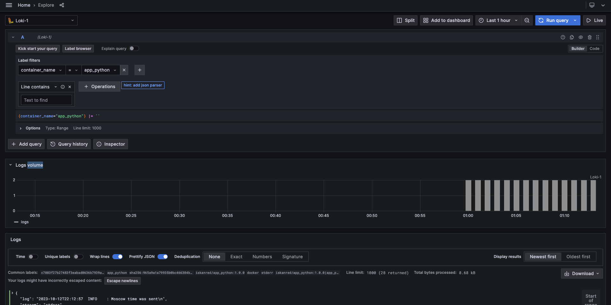
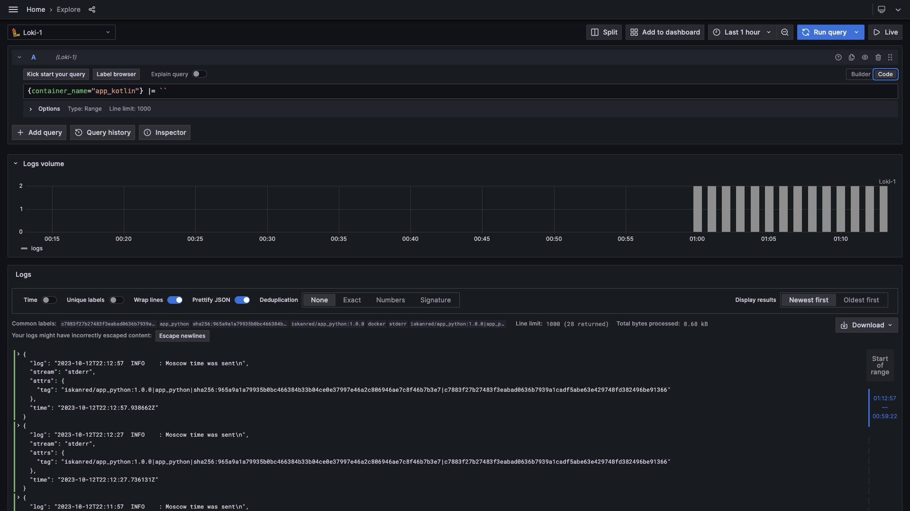
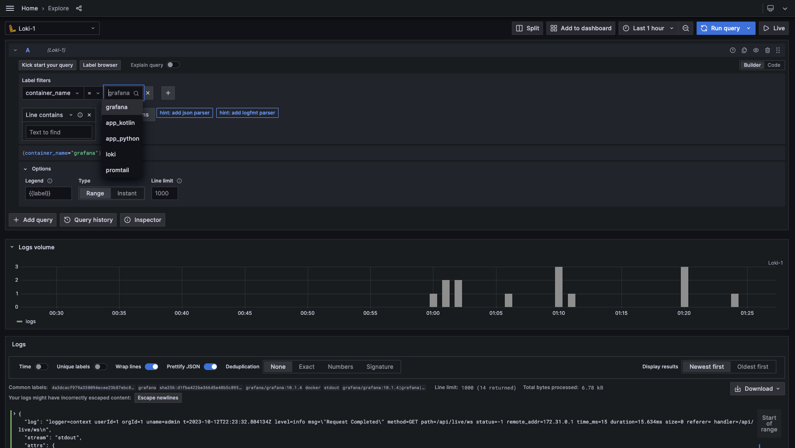
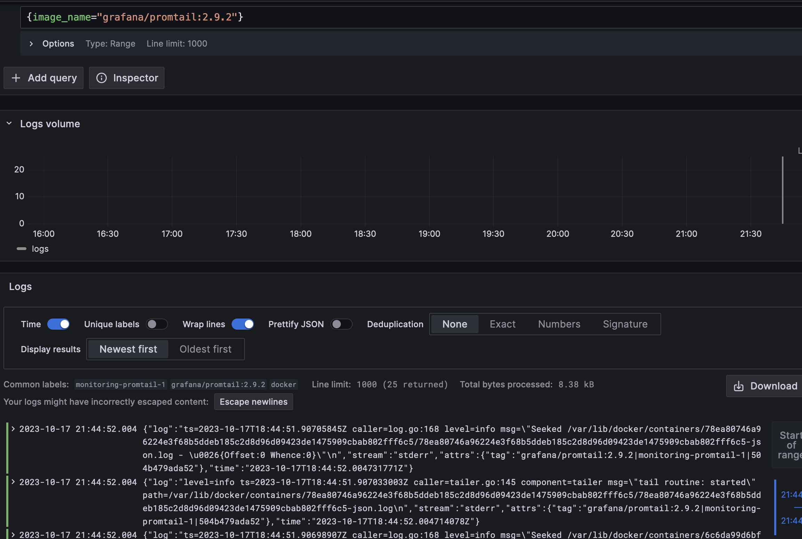
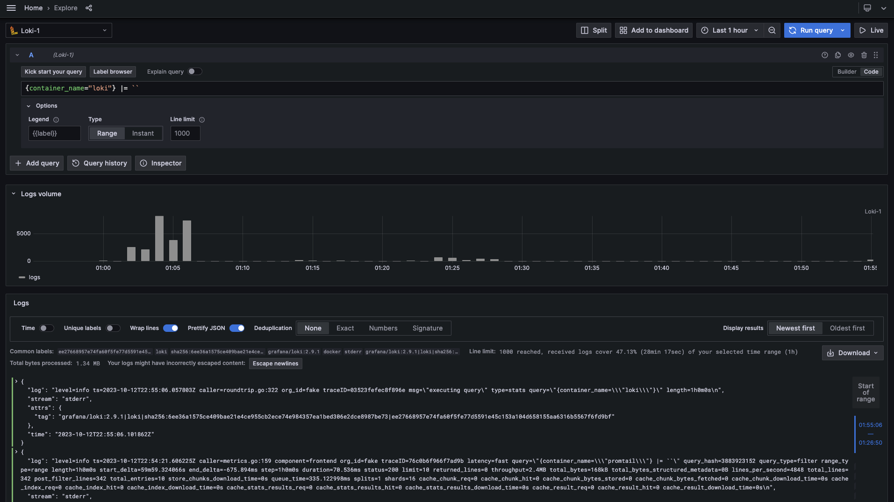

# Logging

## The logging stack:
### Tools
* **Grafana** is needed to visualize logs in GUI with flexible configuration of aggregations and visualizing methods.
* **Loki** is log aggregation system.
* **Promtail** is an agent which ships the contents of local logs to **Loki**.

### Log source
Logs are fetched from the running docker containers by **Promtail** in the following JSON format:
```json
{
  "log": "message",
  "stream": "stream",
  "attrs": {
    "tag": "image_name|container_name|image_id|container_id"
  },
  "time": "yyyy-mm-ddThh:mm:ss.nsZ"
}
```

### Log aggregation
From the above we can see that logs can be aggregated by: stream, tag, docker image name, container name, image ID, container ID. Also by filename and job (`docker`).

---

## Docker Compose
### Containers
* **app_python** is a Python web app
* **app_kotlin** is a Kotlin web app
* **grafana** is an instance of Grafana
* **loki** is an instance of Loki
* **promtail** is an instance of Promtail

All these containers generate logs which are fetched by **Promtail**, aggregated by **Loki**, and we can see their visualization with **Grafana**.

### How to run?
```shell
docker compose -up -d
```

## Results
### Visualization of `app_python` logs


### Visualization of `app_kotlin` logs


### Visualization of `grafana` logs


### Visualization of `promtail` logs


### Visualization of `loki` logs

