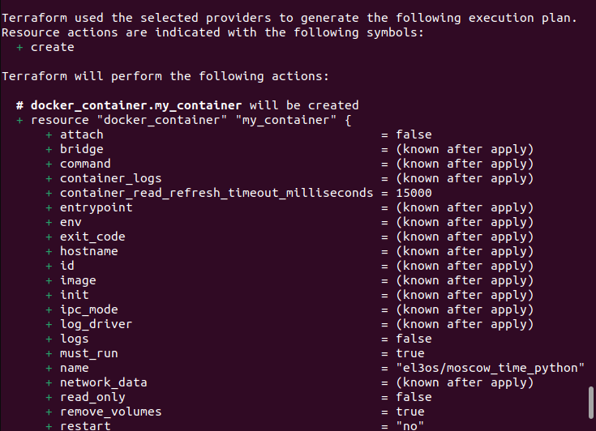
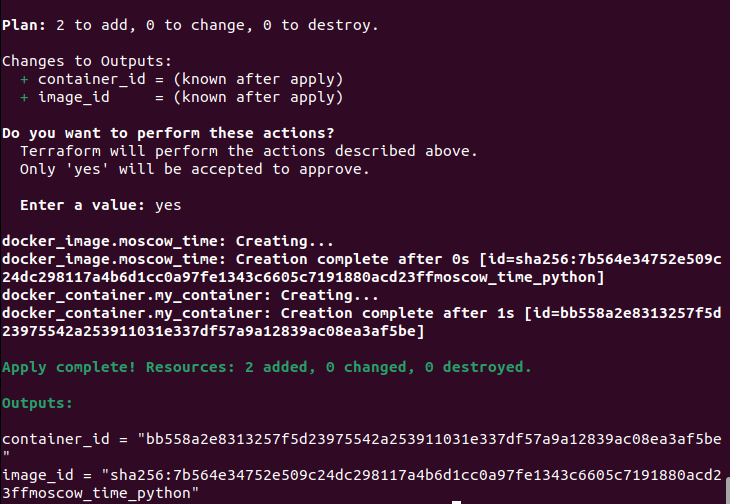
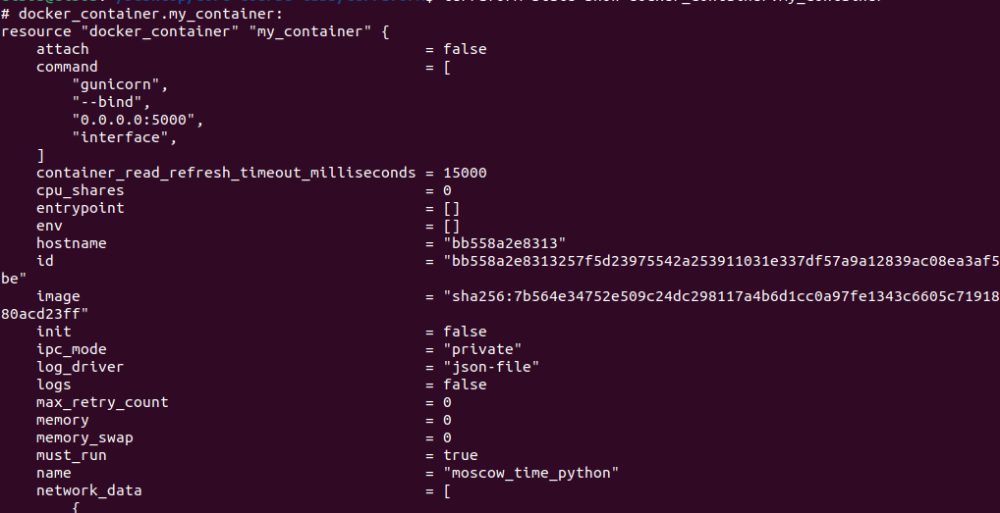
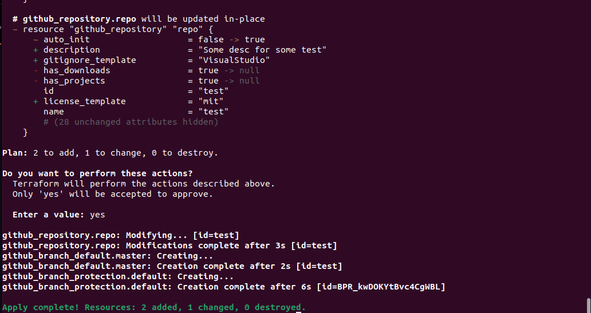
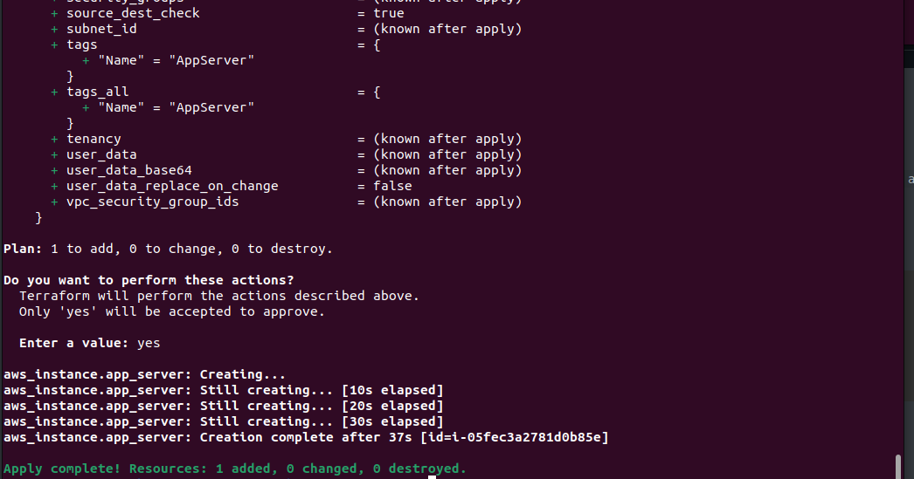

# Infrastructure as Code

## Table of Contents

1. [Overview](#1-Overview)

   1.1. [Terraform](#11-Terraform)

2. [Goal](#2-Goal)

3. [Steps](#3-Steps)

   3.1. [Prerequisites](#31-Prerequisites)

   3.2. [Docker Provider](#32-Docker-Provider)

   3.3. [Vagrant Provider](#33-Vagrant-Provider)

   3.4. [GitHub Provider](#34-GitHub-Provider)

   3.5. [AWS Provider](#35-AWS-Provider)

4. [Best Practices](#4-Best-Practices)

5. [Bonus Task](#5-Bonus-Task)

## 1. Overview

### 1.1. Terraform

The core terraform workflow consists of 3 stages:

- **Write:** represent infrastructure as [HCL declarative code](https://www.terraform.io/language). The syntax is built around two constructs: **arguments** and **blocks** (i.e., line-separated arguments and blocks).
  - HCL supports common programming concepts such as **variables**, **types** (string, numeric), **functions** (built-in), and **expressions**.
  - An existing and supported infrastructure can be **import**ed into terraform to start managing it from code.
- **Plan:** terraform creates an execution plan describing actions (e.g., create, modify, or destroy resources) that will be taken based on existing infrastructure **state** (stored in the **backend**) and current **workspace** configuration.
- **Apply:** interact with the service/platform-specific API through their **providers** (published on [**registry**](https://registry.terraform.io/)) to execute the plan.
  - **Named values** are used for working with API keys or other configurations to allow re-usability and avoid hard-coding.
  - **Modules** are used to group resources that are used together as a reusable package.

## 2. Goal

Getting familiar with terraform by:

- Experimenting with the [Docker provider](https://registry.terraform.io/providers/kreuzwerker/docker/latest/docs) following [this tutorial](https://learn.hashicorp.com/collections/terraform/docker-get-started).
- Using [GitHub provider](https://registry.terraform.io/providers/integrations/github/latest/docs) to manage an existing GitHub repository from code.
- Using [AWS provider](https://registry.terraform.io/providers/hashicorp/aws/latest/docs) to provision an EC2 instance.

## 3. Steps

### 3.1. Prerequisites

- Install [Terraform CLI](https://www.terraform.io/downloads)
- Create `terraform` directory with 4 subdirectories (modules) for `github`, `docker`, and `aws`.

### 3.2. Docker Provider

- Write [main.tf](../terraform/docker/main.tf) that uses docker provider [kreuzwerker/docker](https://github.com/kreuzwerker/terraform-provider-docker) to create resources of types `docker_image` and a `docker_container`.

- Parametrize `container_name` in [variables.tf](../terraform/docker/variables.tf) and define outputs in `outputs.tf`

- Use terraform to run the docker app

  ```bash
  terraform init
  terraform validate
  terraform fmt
  terraform plan
  ```

  

- Apply plan with the custom value: `terraform apply -var 'container_name=moscow_time_python'`

  

- Show list

  

  

### 3.4. GitHub Provider

- Write [main.tf](../terraform/github/main.tf) that uses `integrations/github` provider.

- Configure `github` provider with `token` declared in [variables.tf](../terraform/github/variables.tf) and assign the value from command line or `.tfvars` file.

- Declare resources of types `github_repository`, `github_branch`, `github_branch_default`, and `github_branch_protection_v3` with the desired configurations.

- Import the remote repo to use the existing configuration

  ```bash
  terraform import github_repository.<resource_name> <repo_name>
  ```

- Use the same terraform commands as above to manage the repository configuration from terraform.

- **Terraform configurations applied**

  

### 3.5. AWS Provider

- Download AWS CLI and configure AWS secret key and id
- Write [main.tf](../terraform/aws/main.tf) that uses `hashicorp/aws` provider to provision an EC2 instance by creating an `aws_instance` resource.

- Specify the OS to run using its corresponding AMI ([Ubuntu](https://cloud-images.ubuntu.com/locator/ec2/) examples).

- Run

  ```bash
  terraform init
  terraform validate
  terraform fmt
  terraform plan
  terraform apply
  ```

- Verify instance was created

  

  

- Destroy instance with `terraform destroy`

## 4. Best Practices

- Use an IDE plugin to help with syntax highlighting and autocompletion ([official VSCode plugin](https://marketplace.visualstudio.com/items?itemName=HashiCorp.terraform)).
- Use built-in formatter and validator, check plan before applying changes.
- Sensitive information (state and secret variables) shouldn’t be pushed to the VCS; they can be stored locally and ignored by the VCS, or stored remotely and encrypted at rest ([.gitignore for terraform](https://github.com/github/gitignore/blob/main/Terraform.gitignore)).
- Recommended directory structure and file naming for a minimal module:

  ```bash
  .
  ├── README.md     # module description
  ├── main.tf       # entry point (resource definition)
  ├── variables.tf  # input variables and locals
  ├── outputs.tf    # output variables
  ```

- When using providers (for vagrant or terraform), be sure to pin their versions to ensure reproducibility.


